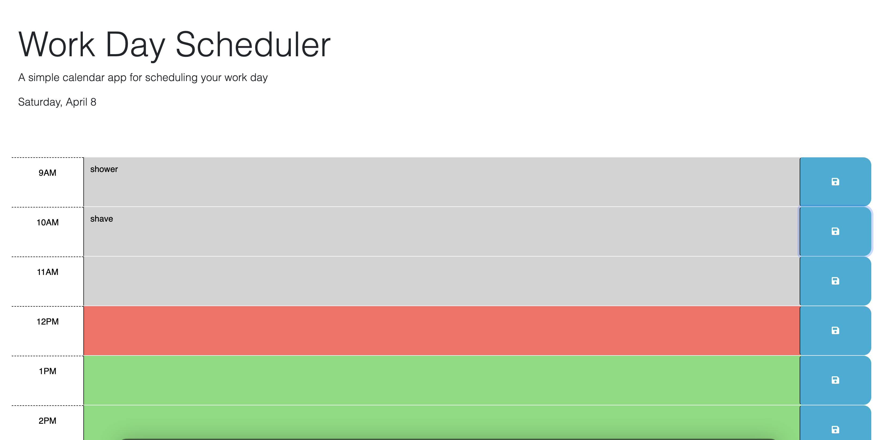

# work-day-scheduler

## Description 

When the user opens the planner, the current day is displayed at the top of the calender.

When the user scrolls down, they are presented with time blocks for standard business hours.

When the user views the time blocks for that day, each time block is color-coded to indicate whether it is in the past, present, or future.

When the user clicks into a time block, they can enter an event.

When the user clicks the save button for that time block, the text for that event is saved in local storage.

When the user refreshes the page, their saved events persist.

## Screenshot

## Deployment 

[Delpoyed App](https://taylorbwatters.github.io/work-day-scheduler/)